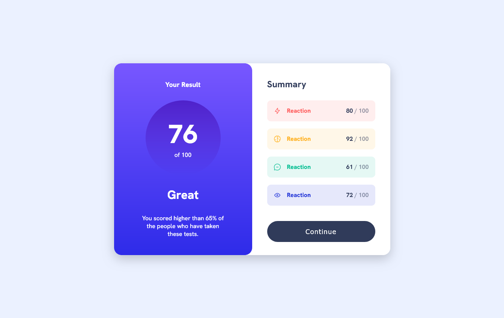

# Frontend Mentor - Results summary component solution

This is a solution to the [Results summary component challenge on Frontend Mentor](https://www.frontendmentor.io/challenges/results-summary-component-CE_K6s0maV). Frontend Mentor challenges help you improve your coding skills by building realistic projects. 

## Table of contents

- [Overview](#overview)
  - [The challenge](#the-challenge)
  - [Screenshot](#screenshot)
  - [Links](#links)
- [My process](#my-process)
  - [Built with](#built-with)
  - [What I learned](#what-i-learned)
  - [Continued development](#continued-development)
  - [Useful resources](#useful-resources)
- [Author](#author)

## Overview

### The challenge

Users should be able to:

- View the optimal layout depending on their device's screen size
- See hover states for interactive elements

### Screenshot

### Links

- Solution URL: [HTML Solution](https://github.com/hitmorecode/results-summary-component/blob/main/index.html)
- Solution URL: [CSS Solution](https://github.com/hitmorecode/results-summary-component/blob/main/css/style.css)
- Live Site URL: [Live site](https://hitmorecode.github.io/results-summary-component/)

## My process

### Built with

- Semantic HTML5 markup
- CSS custom properties
- Flexbox

### Useful resources

- [CSS-Tricks](https://css-tricks.com/snippets/css/a-guide-to-flexbox/) - This is an amazing article which helped me getting started with flexbox. I'd recommend it to anyone still learning this concept.
- [Colt Steele - Flexbox tutorial](https://www.youtube.com/watch?v=qZv-rNx0jEA) - This video helped me understand flexbox. If you are struggling with flexbox like I did, I recommend this video.

## Author

- Frontend Mentor - [@hitmorecode](https://www.frontendmentor.io/profile/hitmorecode)